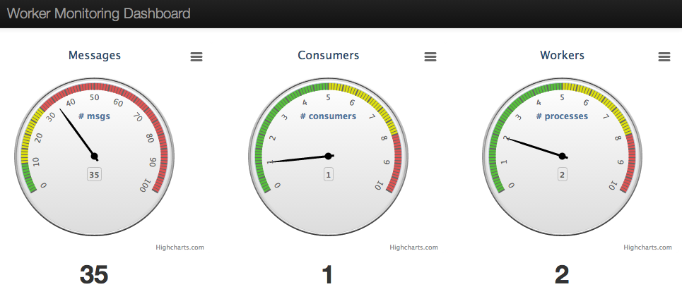

# Cloud Foundry Autoscaler

This project demonstrates the autoscaling of worker processes in a tradtional producer-consumer setting using RabbitMQ as the message queue. Workers are artifically throttled to create a queuing scenario.

## Running on Pivotal Web Services ##

This section will assume that you have a Pivotal Web Services account. If not, create one at http://console.run.pivotal.io/register.

### Building

The autoscaler component depends on the Cloud Foundry Java Client Library (https://github.com/cloudfoundry/cf-java-client/tree/master/cloudfoundry-client-lib). The cf-java-client currently depends on Spring 3.2. The cf-autoscaler applications are written using Spring 4.0. A branch of cf-java-client that works with Spring 4.0 has been created. First we'll need to build that from source.

1. `git clone git@github.com:cloudfoundry/cf-java-client.git`
1. `cd cf-java-client`
1. `git checkout spring4`
1. `mvn install` (You'll need a recent version of [Apache Maven](http://maven.apache.org/). You'll also need a [protocol buffer compiler](https://github.com/cloudfoundry/cf-java-client/issues/163).)

Now that we have this in our local Maven repository, we can build the cf-autoscaler components. Before building, we'll make some minor changes to the code:

* In your favorite editor, create the file `cf-autoscaler/autoscaler/src/main/resources/cf-security.yml`. Add the following contents, substituting your username and password for Pivotal Web Services:

    ```
    ---
    email: user@domain.com
    password: sup3rs3cur3
    ```
* Next, open the file `cf-autoscaler/autoscaler/src/main/resources/application.yml`. At the top of the file you'll find a set of properties labeled `cf`:

    ```
    ---
    cf:
      applicationName: worker-process
      target: http://api.run.pivotal.io
      org: jwatters-org
      space: autoscale
    ```

    Ensure that the `org` and `space` properties reflect the organization and space to which you're going to push the application.
* The Web UI depends on the [highcharts](http://www.highcharts.com) library which is free for non-commercial use. After cloning the repo you will need to download highcharts and copy the contents of the 'js' folder in the distribution to the 'cf-autoscaler/monitor/src/main/resources/static/assets/js/highcharts' directory.

    The app has been tested with Highcharts-3.0.5.

Now we're ready to build the component jars: 

1. `cd cf-autoscaler`
1. `./gradlew assemble` (The `gradlew` [Gradle](http://gradle.org) wrapper will download the appropriate version of Gradle and then build the project artifacts.)

### Deploying

The project includes a `manifest-pws.yml` file that includes the necessary metadata to deploy the four components:

* **producer-process**: Produces text messages that are sent to a RabbitMQ exchange
* **worker-process**: Consumes text messages from a RabbitMQ queue that is bound to the producer's target exchange. The worker is artificially throttled to create the need for scaling.
* **autoscaler-process**: Monitors the queues, and based on configurable thresholds, will increase/decrease the number of **worker-process** instances via the Cloud Foundry API.
* **autoscale-monitor**: A web UI containing gauges for queue length, number of queue consumers, and number of **worker-process** instances.

It will also bind to these applications a RabbitMQ service provided by [CloudAMQP](http://www.cloudamqp.com/) via the Pivotal Web Services Marketplace.

You will need to create this service in advance via `cf create-service cloudamqp bunny cloudamqp-autoscale`. It uses the _Big Bunny_ plan, which is $99 per month, but represents the smallest plan that can provide the necessary connections for this demo (One connection each for the **producer-process** and **autoscaler-process**, plus _n_ connections for the **worker-process** instances. With the current throttling settings, instances usually cycle between one and six instances. By tweaking the settings, you may be able to get away with a _Tough Tiger_ plan at $19/month.). You can learn more about CloudAMQP plans [here](http://www.cloudamqp.com/plans.html).

Assuming you've installed the CF CLI, from the `cf-autoscaler` directory:

1. `cf api https://api.run.pivotal.io`
1. `cf login` (Provide your credentials and choose an appropriate organization and space. You'll need a memory quota of around 4 GB.)
1. `cf push -f manifest-pws.yml`

This will deploy all of the components in the order shown above.

The web UI will be available at a URL with a random word appended to the hostname. You'll see it as one of the last output lines from the `cf push` command:

```
urls: autoscale-monitor-f2840.cfapps.io
```

You can visit this URL to see the gauges working:



Another useful way to monitor the application is via the CF CLI, which supports tailing of application logs via the Cloud Foundry [Loggregator](https://github.com/cloudfoundry/loggregator).

Example:

```
 cf logs autoscaler-process
Connected, tailing logs for app autoscaler-process in org jwatters-org / space autoscale as mstine@gopivotal.com...

2014-01-10T10:43:13.00-0600 [API]     OUT Created app with guid 0186722f-0843-4111-a96f-8d145195b276
2014-01-10T10:43:42.41-0600 [API]     OUT Updated app with guid 0186722f-0843-4111-a96f-8d145195b276 ({"console"=>true, "state"=>"STARTED"})
2014-01-10T10:53:24.73-0600 [App/0]   OUT 2014-01-10 16:53:24.730  INFO 31 --- [ask-scheduler-7] com.gopivotal.cf.autoscaling.Autoscaler  : { workers : 1}
2014-01-10T10:53:26.68-0600 [App/0]   OUT 2014-01-10 16:53:26.681  INFO 31 --- [ask-scheduler-7] com.gopivotal.cf.autoscaling.Autoscaler  : { workers : 1}
2014-01-10T10:53:27.29-0600 [App/0]   OUT 2014-01-10 16:53:27.292  INFO 31 --- [ask-scheduler-1] com.gopivotal.cf.autoscaling.Autoscaler  : { msgs : 53 consumers : 1}
2014-01-10T10:53:27.36-0600 [App/0]   OUT 2014-01-10 16:53:27.362  INFO 31 --- [ask-scheduler-6] com.gopivotal.cf.autoscaling.Autoscaler  : { msgs : 53 consumers : 1}
2014-01-10T10:53:29.36-0600 [App/0]   OUT 2014-01-10 16:53:29.360  INFO 31 --- [ask-scheduler-6] com.gopivotal.cf.autoscaling.Autoscaler  : { msgs : 54 consumers : 1}
2014-01-10T10:53:31.35-0600 [App/0]   OUT 2014-01-10 16:53:31.359  INFO 31 --- [ask-scheduler-6] com.gopivotal.cf.autoscaling.Autoscaler  : { msgs : 55 consumers : 1}
2014-01-10T10:53:32.14-0600 [App/0]   OUT 2014-01-10 16:53:32.146  INFO 31 --- [ask-scheduler-9] com.gopivotal.cf.autoscaling.Autoscaler  : { workers : 1}
2014-01-10T10:53:32.71-0600 [App/0]   OUT 2014-01-10 16:53:32.710  INFO 31 --- [ask-scheduler-9] com.gopivotal.cf.autoscaling.Autoscaler  : { workers : 2}
```

## Running on Pivotal CF Elastic Runtime ##

This section will assume that you have an account on an existing Pivotal CF Elastic Runtime environment.

### Building

The autoscaler component depends on the Cloud Foundry Java Client Library (https://github.com/cloudfoundry/cf-java-client/tree/master/cloudfoundry-client-lib). The cf-java-client currently depends on Spring 3.2. The cf-autoscaler applications are written using Spring 4.0. A branch of cf-java-client that works with Spring 4.0 has been created. First we'll need to build that from source.

1. `git clone git@github.com:cloudfoundry/cf-java-client.git`
1. `cd cf-java-client`
1. `git checkout spring4`
1. `mvn install` (You'll need a recent version of [Apache Maven](http://maven.apache.org/). You'll also need a [protocol buffer compiler](https://github.com/cloudfoundry/cf-java-client/issues/163).)

Now that we have this in our local Maven repository, we can build the cf-autoscaler components. Before building, we'll make some minor changes to the code:

* In your favorite editor, create the file `cf-autoscaler/autoscaler/src/main/resources/cf-security.yml`. Add the following contents, substituting your username and password for Pivotal CF:

    ```
    ---
    email: user@domain.com
    password: sup3rs3cur3
    ```
* Next, open the file `cf-autoscaler/autoscaler/src/main/resources/application.yml`. At the top of the file you'll find a set of properties labeled `cf`:

    ```
    ---
    cf:
      applicationName: worker-process
      target: http://api.cf.deepsouthcloud.com
      org: mstine-org
      space: demo
    ```

    Ensure that the `target`, `org`, and `space` properties reflect the organization and space to which you're going to push the application.
* The Web UI depends on the [highcharts](http://www.highcharts.com) library which is free for non-commercial use. After cloning the repo you will need to download highcharts and copy the contents of the 'js' folder in the distribution to the 'cf-autoscaler/monitor/src/main/resources/static/assets/js/highcharts' directory.

    The app has been tested with Highcharts-3.0.5.

Now we're ready to build the component jars:

1. `cd cf-autoscaler`
1. `./gradlew assemble` (The `gradlew` [Gradle](http://gradle.org) wrapper will download the appropriate version of Gradle and then build the project artifacts.)

### Deploying

The project includes a `manifest-pcf.yml` file that includes the necessary metadata to deploy the four components:

* **producer-process**: Produces text messages that are sent to a RabbitMQ exchange
* **worker-process**: Consumes text messages from a RabbitMQ queue that is bound to the producer's target exchange. The worker is artificially throttled to create the need for scaling.
* **autoscaler-process**: Monitors the queues, and based on configurable thresholds, will increase/decrease the number of **worker-process** instances via the Cloud Foundry API.
* **autoscale-monitor**: A web UI containing gauges for queue length, number of queue consumers, and number of **worker-process** instances.

It will also bind to these applications a Pivotal RabbitMQ for Pivotal CF service instance. This service must be installed in your Pivotal CF environment.

You will need to create this service in advance via `cf create-service p-rabbitmq standard rmq-autoscale`.

Assuming you've installed the CF CLI, from the `cf-autoscaler` directory:

1. `cf api https://api.yourpcfsystemdomain.com`
1. `cf login` (Provide your credentials and choose an appropriate organization and space. You'll need a memory quota of around 4 GB.)
1. `cf push -f manifest-pcf.yml`

This will deploy all of the components in the order shown above.

The web UI will be available at a URL with a random word appended to the hostname. You'll see it as the last output from the `cf push` command:

```
urls: autoscale-monitor-f2840.yourpcfappdomain.com
```

You can visit this URL to see the gauges working:


Another useful way to monitor the application is via the CF CLI, which supports tailing of application logs via the Cloud Foundry [Loggregator](https://github.com/cloudfoundry/loggregator).

Example:

```
 cf logs autoscaler-process
Connected, tailing logs for app autoscaler-process in org jwatters-org / space autoscale as mstine@gopivotal.com...

2014-01-10T10:43:13.00-0600 [API]     OUT Created app with guid 0186722f-0843-4111-a96f-8d145195b276
2014-01-10T10:43:42.41-0600 [API]     OUT Updated app with guid 0186722f-0843-4111-a96f-8d145195b276 ({"console"=>true, "state"=>"STARTED"})
2014-01-10T10:53:24.73-0600 [App/0]   OUT 2014-01-10 16:53:24.730  INFO 31 --- [ask-scheduler-7] com.gopivotal.cf.autoscaling.Autoscaler  : { workers : 1}
2014-01-10T10:53:26.68-0600 [App/0]   OUT 2014-01-10 16:53:26.681  INFO 31 --- [ask-scheduler-7] com.gopivotal.cf.autoscaling.Autoscaler  : { workers : 1}
2014-01-10T10:53:27.29-0600 [App/0]   OUT 2014-01-10 16:53:27.292  INFO 31 --- [ask-scheduler-1] com.gopivotal.cf.autoscaling.Autoscaler  : { msgs : 53 consumers : 1}
2014-01-10T10:53:27.36-0600 [App/0]   OUT 2014-01-10 16:53:27.362  INFO 31 --- [ask-scheduler-6] com.gopivotal.cf.autoscaling.Autoscaler  : { msgs : 53 consumers : 1}
2014-01-10T10:53:29.36-0600 [App/0]   OUT 2014-01-10 16:53:29.360  INFO 31 --- [ask-scheduler-6] com.gopivotal.cf.autoscaling.Autoscaler  : { msgs : 54 consumers : 1}
2014-01-10T10:53:31.35-0600 [App/0]   OUT 2014-01-10 16:53:31.359  INFO 31 --- [ask-scheduler-6] com.gopivotal.cf.autoscaling.Autoscaler  : { msgs : 55 consumers : 1}
2014-01-10T10:53:32.14-0600 [App/0]   OUT 2014-01-10 16:53:32.146  INFO 31 --- [ask-scheduler-9] com.gopivotal.cf.autoscaling.Autoscaler  : { workers : 1}
2014-01-10T10:53:32.71-0600 [App/0]   OUT 2014-01-10 16:53:32.710  INFO 31 --- [ask-scheduler-9] com.gopivotal.cf.autoscaling.Autoscaler  : { workers : 2}
```
